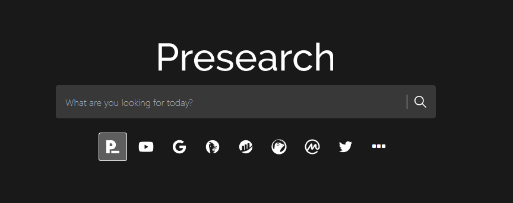

# Presearch-Bot by pedroelhumano

I managed to get this to work using:
- Windows 11 x64
- Chrome version 103.0.5060.53
- Python 3.10.5
- pip 22.1.2

This is not necessarily a requirement but I haven't tested it in other instances

### Do this commands:
- `pip install selenium`
- `pip3 install webdriver-manager`

### How work
- You need to log previously in presearch
- In the presearch_ch.py file you have to modify the path ("user-data-dir=C:\\Users\\pedro\\AppData\\Local\\Google\\Chrome\\User Data") to the corresponding path on your computer
- Download webdriver for chrome according to your version and place the .exe in the webdriver folder
- To execute:
  * Do in the console: `py presearch_ch.py`
  * Edit the `autorunCh.bat` file to create a autorun
- Earn `pre` tokens

<h3>¡Sigueme en mis redes!</h3>

